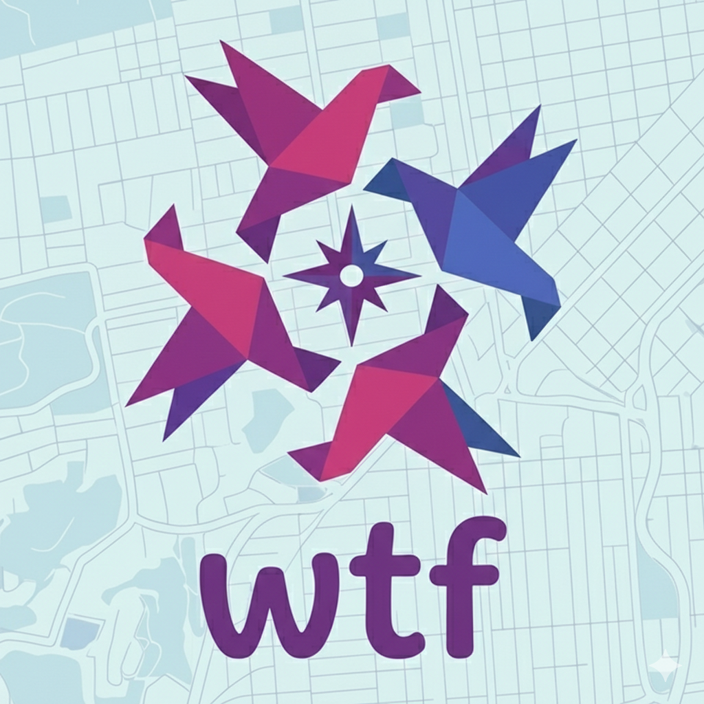

<div align="center">
  
  <h1>Where To Flock (wtf)</h1>
  <p>Two friends. One day. Claude decides the interface.</p>
  <p><strong><a href="https://youtu.be/GXQFFNbhqRI?si=BSHpapUSXRowHdPJ">▶️ Watch the Demo Video</a></strong></p>
</div>

**Where To Flock** is a collaborative day-trip planner where generative UI replaces fixed forms. Two people plan a shared day in NYC — each person claims sections of the itinerary and works through AI-selected decision components in their own sidebar. Claude chooses the right widget for each decision in real time based on the domain, the person's preferences, and their prior answers.

## The Interface

```
┌─────────────────────────────────────────────────────┐
│                 WHERE TO FLOCK · NYC Day             │
├──────────────┬─────────────────────────┬────────────┤
│              │                         │            │
│   ABBY       │    SHARED ITINERARY     │   MIKE     │
│   SIDEBAR    │                         │   SIDEBAR  │
│              │  ┌─────────────────┐    │            │
│  (genUI      │  │ 9am  Breakfast  │    │  (genUI    │
│   lives      │  ├─────────────────┤    │   lives    │
│   here)      │  │ 10am Morning    │    │   here)    │
│              │  ├─────────────────┤    │            │
│              │  │ 12pm Lunch      │    │            │
│              │  ├─────────────────┤    │            │
│              │  │ 1:30 Afternoon  │    │            │
│              │  ├─────────────────┤    │            │
│              │  │ 6pm  Dinner     │    │            │
│              │  └─────────────────┘    │            │
│              │                         │            │
└──────────────┴─────────────────────────┴────────────┘
```

## How It Works

### 1. Claim
The itinerary starts with all blocks unclaimed (grey). Each person drags blocks to claim them, or assigns them to AI.

### 2. Decide (parallel)
Claude generates 2–3 decision steps per claimed block, selecting from a pre-built component catalog:

| Component | What it does |
|-----------|-------------|
| `mood_board` | Image grid for vibe decisions ("What does lunch feel like?") |
| `this_or_that` | Rapid binary preference pairs |
| `vibe_slider` | Spectrum decisions (casual ↔ fancy) |
| `vibe_slider_2d` | Two-axis decisions (chill/active × local/tourist) |
| `comparison_cards` | 2–4 specific options with expandable detail |
| `comparison_table` | Feature-based option comparison |
| `quick_confirm` | Simple yes/no on a suggestion |
| `domain_claim` | Drag blocks between people and AI |

### 3. Resolve Conflicts
When two decisions interact (e.g., dinner location vs. afternoon activity location), Claude surfaces the conflict on the shared itinerary with a `conflict_card` that both people can interact with.

### 4. Final Plan
The itinerary fills in with full venue details, transition times, and a styled `final_plan_card` for each block — colors and layout reflecting the overall vibe of the day.

## Team

| Person | Role |
|--------|------|
| **Abby** | Claude layer — system prompts, decision flow, component selection logic, final plan generation |
| **Mike** | Flutter infra — widget catalog, Firebase sync, layout, image search |

## Demo Flow (2 min)

The project includes an "autodrive" script in `kDemoMode` to showcase the parallel interaction model:

1. **Claim (10s)** — Mike (Person B) claims "Morning Activity" in the right sidebar.
2. **Claude Responds (10s)** — Mike gets a `mood_board` component to select a park or museum.
3. **Mike Decides (10s)** — Mike selects "Central Park"; the itinerary updates to "In Progress".
4. **Simultaneous Turn (30s)** — Claude drives both sidebars at once:
    - **Abby (Person A)** gets a `quick_confirm` to approve the Central Park suggestion.
    - **Mike (Person B)** gets `comparison_cards` to choose a lunch spot.
5. **Finalize (20s)** — Once Mike picks lunch, the entire day is finalized.
6. **Success State (40s)** — The itinerary transforms into a high-fidelity "Your Day" view with `final_plan_card` styling and transition details.

## Tech Stack

| Layer | Technology |
|-------|-----------|
| UI | Flutter Web |
| State | Riverpod (Local Mock + Firestore) |
| AI | Claude (structured JSON output) |
| Mode | `kDemoMode` (default) for zero-config demo |

## Getting Started

```bash
# 1. Install dependencies
flutter pub get

# 2. Run on Chrome (ensure kDemoMode = true in lib/main.dart)
flutter run -d chrome
```
